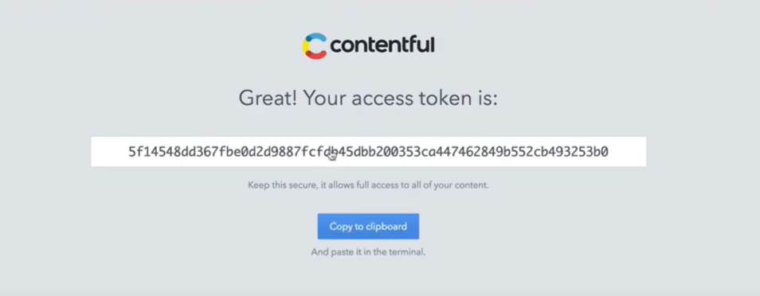
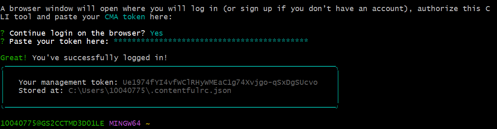

<h1 align="center">Contentful</h1>

## Intro to Contentful for developers

Contentful es una plataforma de gestión de contenido en la nube que permite crear, gestionar y distribuir contenido digital de manera eficiente, puede organizarse de infinitas maneras para diferentes tamaños de pantalla y dispositivos.  
Ofrece herramientas intuitivas para la creación y la edición de contenido.


## Dónde se almacenan sus datos
Contentful es nativo de la nube, en este caso se trata de Amazon Web Services (AWS)

Contentful se basa en 4 API, permite que los sistemas de software se comuniquen entre sí

### Content Management API o CMA
Se utiliza para administrar su contenido, la aplicación web Contentful es una interfaz de creación y edición de contenido y se encuentra en el CMA.
Los desarrolladores pueden interactuar directamente con la API de administración, lo que es especialmente util para automatizar acciones masivas

### Content Delivery API o CDA
Mientras que el CMA es de lectura y escritura para permitir consultas de administración complejas, el CDA es solo de lectura, por lo que su único propósito es enviar contenido rapidamente en su estado de publicación.

### Preview API
Le permite ver su contenido en su estado de borrador 

### Images API
Es especialmente para manejar imagenes 

## Contentful CLI
Contentful CLI es un paquete npm que puede instalar globalmente.

```
npm i -g contentful-cli
```

Para validar que intalamos correctamente contentful-cli podemos usar el comando

```
which contentful
```

Podemos ver todos los comandos disponibles con ejecutar el comando 

```
contentful
```

Contentful CLI utiliza la API de gestión de contenido, esta API permite crear nuevos espacios, configurar tipos de contenido, escribir datos en sus espacios y mucho más.
Para utilizar esta API, debe obtener un token de administración de contenido y luego autorizar la CLI.

Podremos inicar sesión con el siguiente comando, nos abrirá una nueva ventana en el navegador para iniciar sesión en Contentful

```
contentful login
```
imagen

Nos proporcionara un token que posteriorente utilizaremos en nuestra terminal





- Interfaz
- Estructura de contenido
- Conceptos básicos

Crear cuenta de prueba
Integrar Contentful a tu proyecto
Casos de uso y ejemplos

